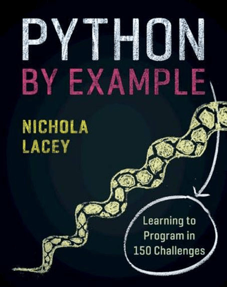

# Python My Example 🐍

This repository contains my personal Python examples, practice scripts, and experiments as I continue learning and exploring Python programming.  

---

## 📖 About This Project
The goal of this repository is to:
- Document my learning journey with Python  
- Store small example programs and test scripts  
- Experiment with different Python concepts such as:  
  - Variables and data types  
  - Control flow (if, for, while)  
  - Functions and modules  
  - File handling  
  - Object-Oriented Programming  
  - Error handling and debugging  

---

## 🖼️ Python Logo

---

## 🚀 Purpose of this Repository
- Keep track of examples I write while practicing Python  
- Serve as a quick reference for Python basics  
- Share scripts that might be useful for other learners  

---

## 🚧 Work in Progress
This repository is a **work in progress** as I keep adding new examples and refining existing scripts.  
Stay tuned for updates!  

---

✍🏽 *Author of this repository*: **Afoke Peniel Oghenekowho**  
